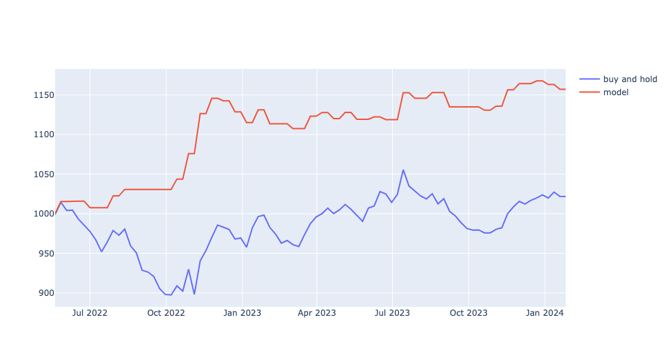
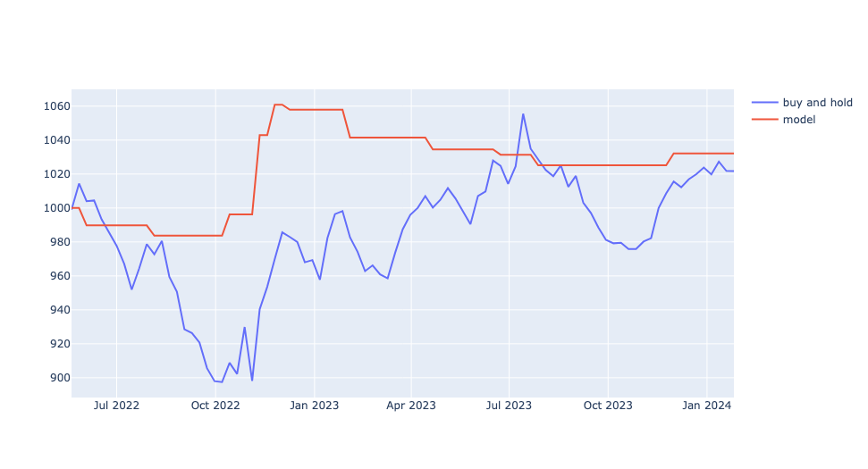

**Important NOTE:** Please see markdowns of every notebook for all details of sections.

## EDA_all_stocks Notebook

This notebook presents a comprehensive EDA and analysis of all stocks, aiming to identify best choices of stocks for investing opportunities.

### Contents

- **Daily Analysis**: We performed EDA on daily returns to understand stock behaviors, examining trends, distributions, statistical measures, and correlations.

- **Missing Value Analysis**: The dataset was scrutinized for missing values, analyzing their percentage, temporal distribution, and the gaps between them to ensure data integrity.

- **Outlier Analysis**: Utilizing boxplots, we identified outliers within each stock, pinpointing those with the least number of outliers as potentially stable investments.

- **Statistical Measures**: We assessed the risk of stocks by analyzing the standard deviation and kurtosis of daily returns, seeking stocks with lower values for safer investment choices.

- **Correlation Analysis**: A heatmap helped us discover pairs of stocks with significant correlations, indicating potential risk or opportunity based on their market relationship. (that could be helpful for prediction)

### Conclusion

The analysis suggests that `AUDUSD=X` and `GBPUSD=X` emerge as suitable candidates for trading, exhibiting lower percentages of outliers and favorable statistical measures of risk (std, kurt). Additionally, the correlation analysis provides fun insights, e.g. highlighting the relationship between `F` (Ford) and `GM` (General Motors) due to their industry ties.

These findings guide us towards selecting `AUDUSD=X` and `GBPUSD=X` for further investigation using ML considering their stability and lower risk profile as indicated by our comprehensive data analysis.

------
## Train ML Model for Single Stock Analysis

The `train_ML_model_single_stock` notebook is dedicated to developing a machine learning model capable of predicting whether a stock will trend upwards or downwards over the following week.
### Notebook Overview

- **Objective**: The primary goal is to identify a reliable classifier that predicts the weekly direction (upward or downward).

- **Missing Values Analysis**: Initial steps include assessing and handling missing data to ensure the dataset's integrity.

- **Downsampling**: Adjusting the dataset to align with the weekly trading constraint by focusing on weekly data points.

- **Data Visualization**: Utilizing line plots and histograms to understand the stock's price movements and identify any non-stationary behavior.

- **Feature Engineering**: Enhancing the dataset with additional features, such as lags of daily returns, phase space reconstruction, simple moving averages, and a  technical indicator(RSI), to improve model accuracy.

- **Stationarity Test**: Ensuring all features used in the model are stationary to prevent time-dependent errors and improve the model's reliability.

- **Correlation Analysis**: Analyzing feature correlations to streamline the feature set by removing highly correlated and redundant features.

- **ML Model Development**: Defining the feature set and target variable, splitting the data into training and testing sets, and evaluating the model using cross-validation with a focus on precision for upward trends.

**Important NOTE:** Please see markdowns of every notebook for all details of sections.

## Results from the Live_Trading Notebook

The Live_Trading notebook applies the trained model to real-world trading scenarios, comparing its performance against a benchmark buy-and-hold strategy. For the stock `GBPUSD=X`, the results from May 2022 to January 2024 are as follows:

### GBPUSD=X Performance Summary

- **With a risk index of 0.50**: Our model achieved a return of 115.7%, outperforming the benchmarked model's return of 102.17%.

- **With a risk index of 0.52**: Our model yielded a return of 103.22%, slightly above the benchmarked return of 102.17%.

